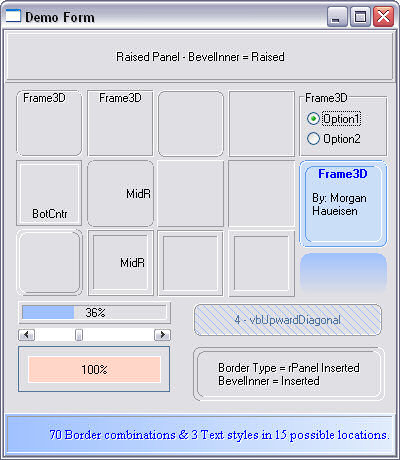



## Frame3D and Line3D

### Description

A replacement for Sheridan's 3D (THREED32.OCX) SSPanel and SSFrame controls. This is not a direct replacement because some of the property names are different. A good alternative when using XP manifest files over VB's Frame control and a picture box (which contains a lot of overhead). This control has 70 different border combinations and 3 text styles that can be positioned one of 15 possible locations. You can change the background, highlight and shadow colors; add gradient fill and/or fill with a pattern.

Also included: Line3D control, automatically create a manifest file, link XP themes to the application, and End an application the proper way. Please see the Readme file for a listing of the property definitions.
 
### More Info
 

             |
---                |---
**Submitted On**   |2004-07-04 13:30:50
**By**             |[Morgan Haueisen](https://github.com/Planet-Source-Code/PSCIndex/blob/master/ByAuthor/morgan-haueisen.md)
**Level**          |Advanced
**User Rating**    |4.8 (121 globes from 25 users)
**Compatibility**  |VB 6\.0
**Category**       |[Custom Controls/ Forms/  Menus](https://github.com/Planet-Source-Code/PSCIndex/blob/master/ByCategory/custom-controls-forms-menus__1-4.md)
**World**          |[Visual Basic](https://github.com/Planet-Source-Code/PSCIndex/blob/master/ByWorld/visual-basic.md)
**Archive File**   |[Frame3D\_an176583742004\.zip](https://github.com/Planet-Source-Code/morgan-haueisen-frame3d-and-line3d__1-54693/archive/master.zip)

